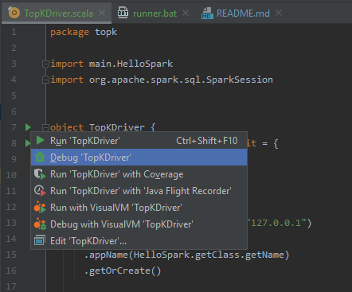
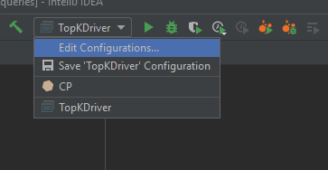
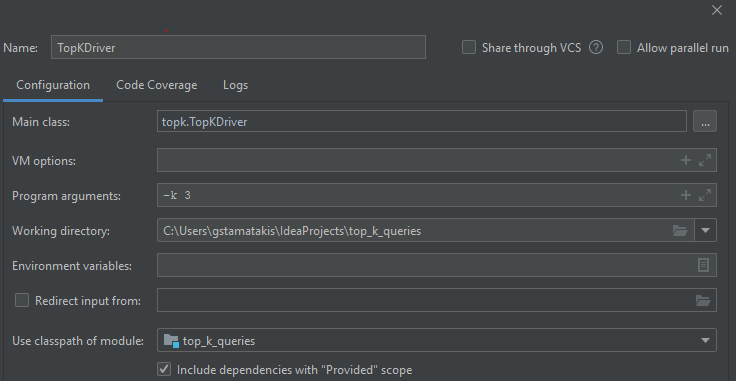

# Top-k queries
Project repository for top-k queries project.

## Contents

[Files](files) contains useful PDFs.

[Datasets](datasets) contains tested datasets.

## Building via cmd line
Run the following:

    sbt assembly

## Running Locally

You can use the Intellij IDEA to run the jar LOCALLY as a program (via the Play/Debug) button.
See bellow.

## Using in Intellij
To use this project in IntelliJ, import the project from existing sources using "sbt". Ensure that the Scala plugin is
installed first. IntelliJ will download `sbt` for you.

<h3>To use Intellij as a LOCAL runner follow these 3 easy steps:</h4>

<h3>1. Run the src/main/scala/topk.TopKDirver in Debug mode (it will crash).</h4>

<h3>2. On the top right edit the configuration settings</h3>

<h3>3. Add the -k 3 as programm arguments and check the 
"Include dependencies with Provided scope" on the bottom.</h4>

You can now run/debug the TopKDriver program from the top right corner of the IDE.

If it's greyed out simply click on it and Save it again.

The Spark app can now be run locally.

## Troubleshooting

If the program isn't running or the output is empty try to run:

    sbt clean assembly